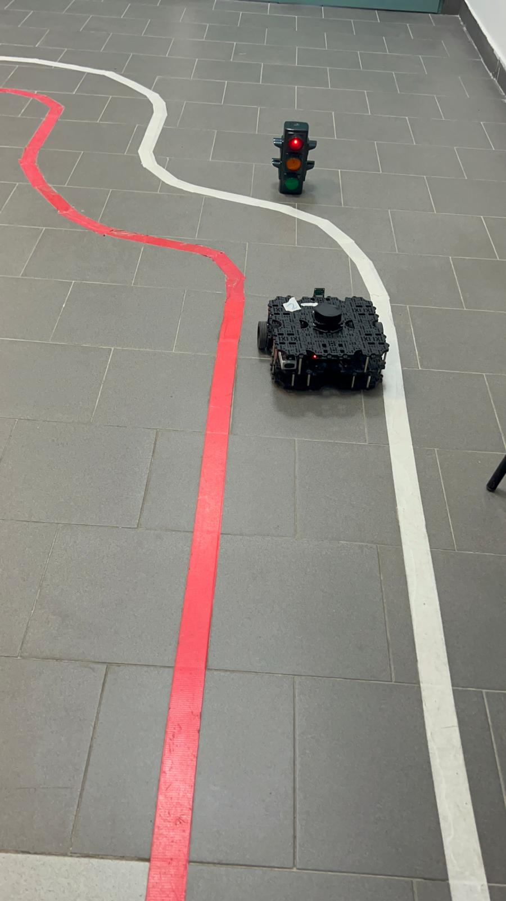
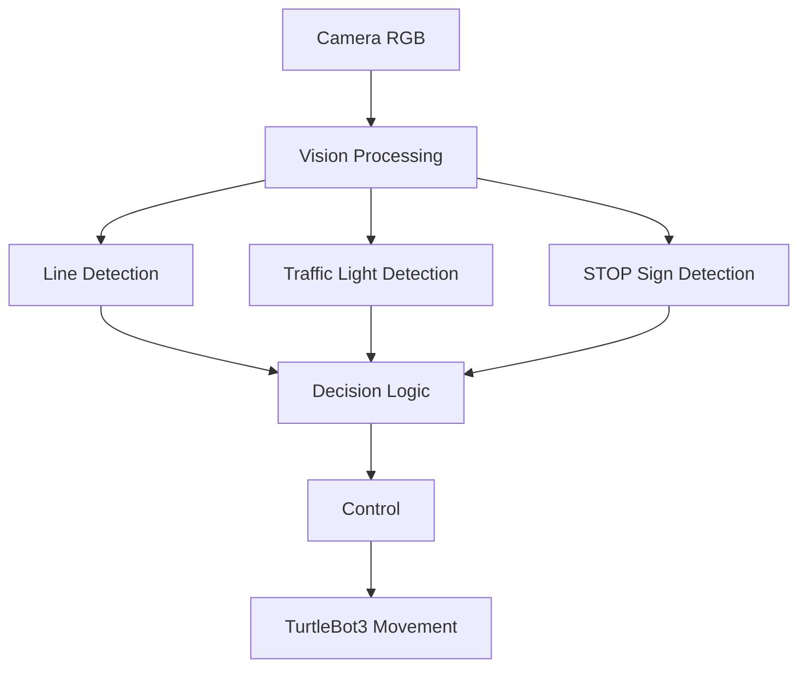

# TurtleBot3 Lane Following & Traffic Light Recognition

[](http://wiki.ros.org/noetic)
[](https://opencv.org/)
[](https://www.turtlebot.com/)

Questo pacchetto ROS permette a un **TurtleBot3 Waffle Pi** di navigare autonomamente all'interno di una corsia, fermarsi ai semafori e riconoscere segnali stradali come lo STOP.



---

## Panoramica del Progetto

Un sistema completo di navigazione autonoma che combina **computer vision** e **controllo robotico** per abilitare TurtleBot3 a:

- Seguire una corsia colorata usando la telecamera
- Rilevare e rispondere a semafori **rossi, gialli e verdi**
- Riconoscere il segnale **STOP**
- Combinare dati della telecamera e del LiDAR per un comportamento robusto

---

## Funzionalità

### Navigazione in Corsia
- Segmentazione della linea di corsia in spazio colore HSV
- Algoritmo di controllo per il centramento nella corsia
- Regolazione della velocità in base alla curvatura

### Riconoscimento Semafori
- Rilevamento luci rosse, gialle e verdi
- Classificazione basata su soglie HSV e analisi dei contorni
- Transizioni di stato (avanti, rallenta, fermati)

### Riconoscimento Segnali Stradali
- Rilevamento segnale STOP
- Segmentazione colore e analisi morfologica
- Integrazione con il sistema di controllo

---

## Architettura del Sistema



## Installazione & Setup

### Prerequisiti
- **ROS Noetic**
- **Pacchetti TurtleBot3** (`turtlebot3_bringup`, `turtlebot3_teleop`)
- **OpenCV 4.x**
- **Catkin build tools**

### Compilazione
```bash
cd ~/catkin_ws
catkin_make
source devel/setup.bash
```
### Utilizzo
Avvio dei Nodi
```bash
# Nodo di elaborazione visione
rosrun autorace vision_processing_node

# Nodo principale di controllo
rosrun autorace turtlebot_control_node
```
### Strumenti di Debug (Opzionali)
```bash
# Tuner parametri linea di corsia
rosrun autorace line_hsv_tuner_node

# Tuner parametri semafori
rosrun autorace trafficlight_hsv_tuner_node
```

### Struttura del Progetto
```bash
src/
├── turtlebot_control.cpp      # Nodo principale: logica decisionale, controllo movimento
├── vision_processing.cpp      # Elaborazione immagini: semafori, linea, segnale STOP
├── line_hsv_tuner.cpp         # Tool debug per visualizzazione linea di corsia
└── trafficlight_hsv_tuner.cpp # Tool debug per calibrazione parametri semafori
```

## Descrizione File

### `turtlebot_control.cpp`
**Nodo principale** che:
- Sottoscrive topic della telecamera
- Controlla il movimento del robot basato su rilevamento corsia e semafori
- Gestisce transizioni di stato (avanti, rallenta, fermati)
- Pubblica stato del traffico

### `vision_processing.cpp`
**Elaborazione visione** che gestisce:
- Segmentazione immagini per rilevare semafori rossi, gialli e verdi
- Segmentazione linea di corsia
- Rilevamento e riconoscimento segnale STOP
- Filtraggio HSV (tonalità, saturazione, luminosità)
- Analisi ROI e classificazione basata su contorni

### `line_hsv_tuner.cpp` & `trafficlight_hsv_tuner.cpp`
**Strumenti di sviluppo** per:
- Calibrazione parametri HSV in tempo reale
- Debug e ottimizzazione delle soglie di rilevamento
- Visualizzazione intermedi di elaborazione

---

## Autori

- **La Torre Noemi**
- **Colacicco Nunziamaria**
    
## Contatti

**Noemi La Torre**
- Email: latorre.noemi17@gmail.com
- LinkedIn: [linkedin.com/in/noemilatorre](https://linkedin.com/in/noemilatorre)
- GitHub: [github.com/noemilatorre](https://github.com/noemilatorre)
- Portfolio: [noemilatorre.github.io](https://noemilatorre.github.io)

---

*Progetto sviluppato per il corso di Robotica Applicata presso l'Università degli Studi di Cassino e del Lazio Meridionale.*
